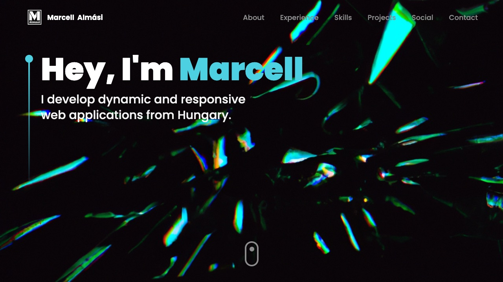

<div align="center">

# 🌐 3D Portfolio

**My personal portfolio — interactive 3D scenes, scroll animations and a working contact form.**

[](https://marcell-almasi.netlify.app/)




</div>

## ✨ Features

- **3D everywhere** — models and particle scenes with `@react-three/fiber` and `drei`
- **Motion** — section reveals with Framer Motion, tilt cards with `react-parallax-tilt`
- **Experience timeline** — vertical timeline of where I've worked
- **Contact form** — sends straight to my inbox via EmailJS, no backend needed
- **Responsive** — works from phone to ultrawide

## 🚀 Run locally

```bash
npm install
npm run dev
```

## 🗂️ Structure

```
src/
├── components/   # Hero, About, Experience, Tech, Projects, Contact …
│   └── canvas/   # Three.js scenes
├── constants/    # content: projects, experience, tech list
└── hoc/          # section wrapper with motion
```
